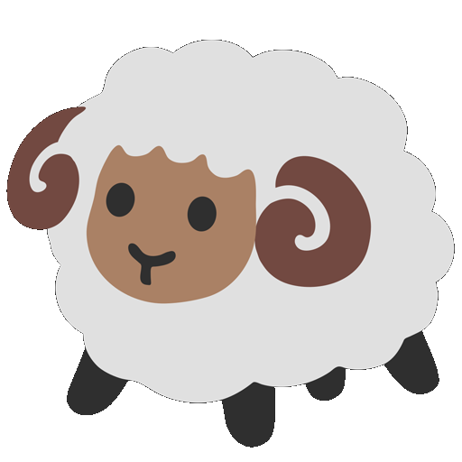

<p align="center">
  <a href="https://github.com/AjayLiu/sheep-or-goat">
    
  </a>

  <h3 align="center">Sheep or Goat?</h3>

  <p align="center">
    A machine learning image classifier that looks at an image and guesses if it's a sheep or a goat.
    <br />
    <a href="https://sheep-goat.herokuapp.com"><strong>Demo Website »</strong></a>
</p>


<!-- TABLE OF CONTENTS -->
<details open="open">
  <summary>Table of Contents</summary>
  <ol>
    <li>
      <a href="#about-the-project">About The Project</a>
      <ul>
        <li><a href="#built-with">Built With</a></li>
      </ul>
    </li>
    <li>
      <a href="#getting-started">Getting Started</a>
      <ul>
        <li><a href="#prerequisites">Prerequisites</a></li>
        <li><a href="#installation">Installation</a></li>
        <li><a href="#development">Development</a></li>
        <li><a href="#development">Deployment</a></li>
      </ul>
    </li>
    <li><a href="#license">License</a></li>
    <li><a href="#contact">Contact</a></li>
    <li><a href="#acknowledgements">Acknowledgements</a></li>
  </ol>
</details>


<!-- ABOUT THE PROJECT -->
## About The Project

</img>
Upload an image of a real life sheep or goat and the trained neural network will try to determine if it is a sheep or a goat. The model was trained with images from Google Images as well as some databases from Kaggle.

### Built With
* [Fast.ai](https://fast.ai)
* [Paperspace](https://www.paperspace.com/)
* [Heroku](https://heroku.com)


<!-- GETTING STARTED -->
## Getting Started

Here is a guide if you want to clone my website and modify it for yourself, all the way to deployment.

### Prerequisites

* [git](https://git-scm.com/)

### Installation

1. Clone the repo
   ```sh
   git clone https://github.com/AjayLiu/sheep-or-goat.git
   ```
2. Create and train your model as outlined in https://youtu.be/XfoYk_Z5AkI
3. Upload your model (.pkl) in path/models

### Development

To run the website, use something like the [VSCode Code Runner Extension](https://marketplace.visualstudio.com/items?itemName=formulahendry.code-runner) to run app.py. Then you can view the site using the URL provided from the command line output.

### Deployment
1. Publish the site on Heroku using continuous git integration. :tada:


<!-- LICENSE -->
## License

Distributed under the MIT License. See `LICENSE` for more information.


<!-- CONTACT -->
## Contact

Ajay Liu - contact@ajayliu.com

Project Link: [https://github.com/AjayLiu/sheep-or-goat](https://github.com/AjayLiu/sheep-or-goat)


<!-- ACKNOWLEDGEMENTS -->
## Acknowledgements
* [Repo that the website is based off of](https://github.com/shankarj67/Water-classifier-fastai)
